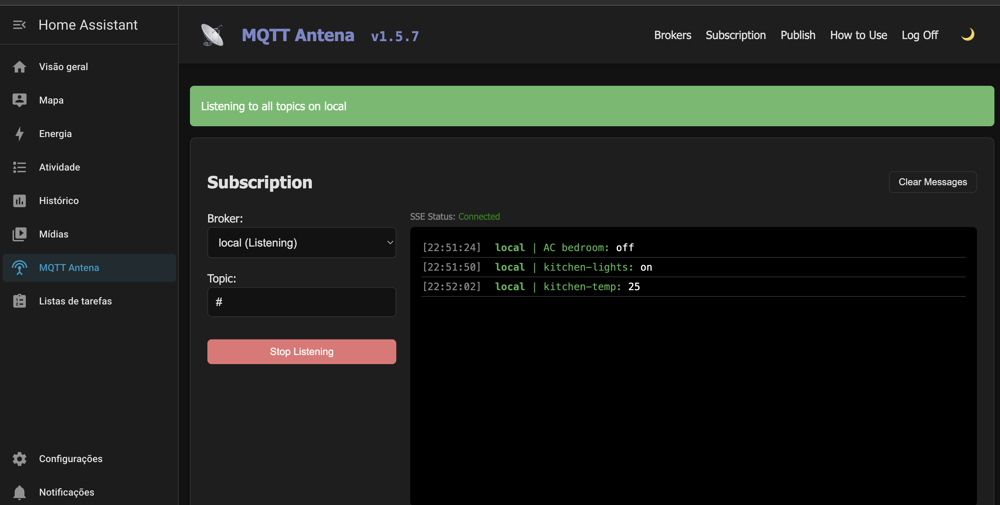

# MQTT Antena Home Assistant Add-on

This directory contains the files to run MQTT Antena as a Home Assistant add-on.

## About

MQTT Antena is a simple, modern, web-based MQTT client application that allows you to manage broker connections, monitor message streams, and publish messages through a clean web interface.

For more info check the [documentation page](https://fbossolan.github.io/mqtt-antena/)

  

